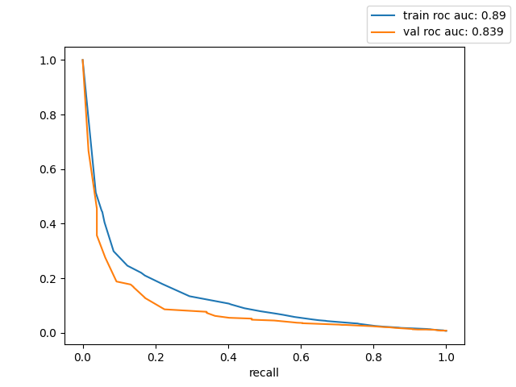

# Hacks AI Кейс Минздрава спасение жизней с помощью ИИ

https://hacks-ai.ru/hakaton/samara

Прогноз риска летального исхода у пациентов, находящихся на стационарном лечении и выявления факторов, коррелирующих с целевым признаком.

## Решение

- Tf-ifd + LogReg = ❤ (что может быть лучше для MVP)
- Сделана лемматизация (pymorphy2 thanks)
- Кол-во токенов сведено к минимуму (120 токенов)
- Подобраны оптимальные гиперпараметры модели (баланс между качеством и переобучением)
- Использована калибровка вероятностей (0.1, теперь значит что пациент в группе где 1 летальный исход на 10 человек)

Используя данную модель можно выделять 1.2% пациентов у которых риск летального исхода 25+% 

## Установить

```shell script
pip install requirements.txt
``` 

## Запустить

```shell script
python main.py
```

## Получившиеся результаты 

light | precision | recall | thresholds | roc_auc | count | count_ratio | type
----- | --------- | -----  | ---------- | ------- | ----- | ----------- | -----
yellow | 0.128 | 0.171 | 0.078 | 0.839 | 337 | 6.4 | val
red    | 0.276 | 0.062 | 0.176 | 0.839 | 64 | 1.2 | val



### Топ позитивных токенов 

    состояние удовлетворительный удовлетворительный сознание самостоятельно норма 
    напряжение патология определяться орган приём узел ка удовлетворительный наполнение
    препарат чсс сердце не позвоночник не увеличить для хронический гастрит плановый
    тактика

### Топ негативных токенов

    кровь жёсткий лёгочный покой номер решение высокий общий слабость хсн выраженный
    пациент нижний одышка положение полость 60 снижение головной мина
